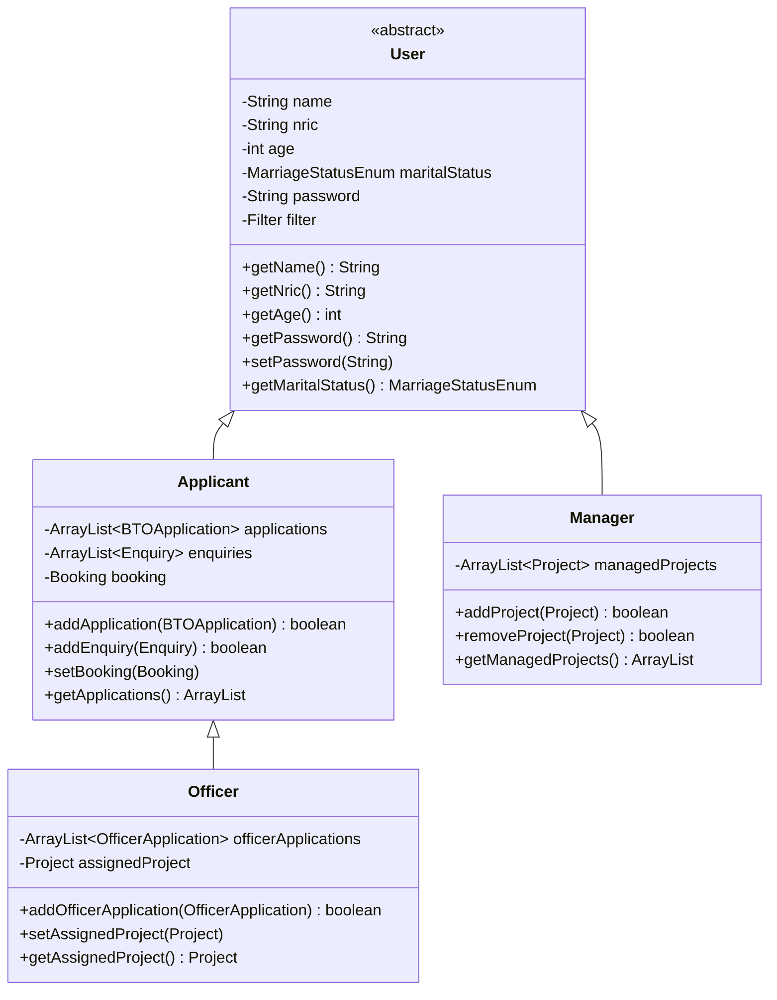
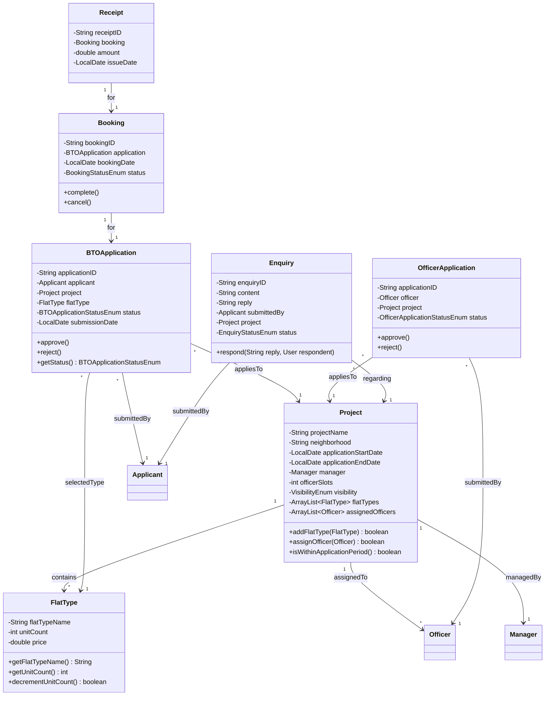
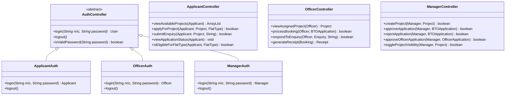
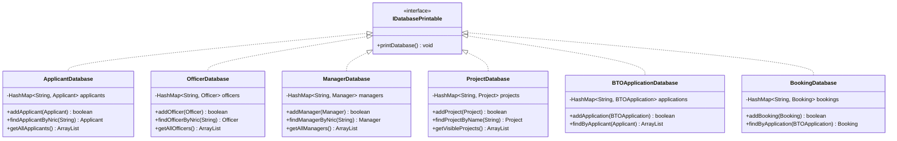
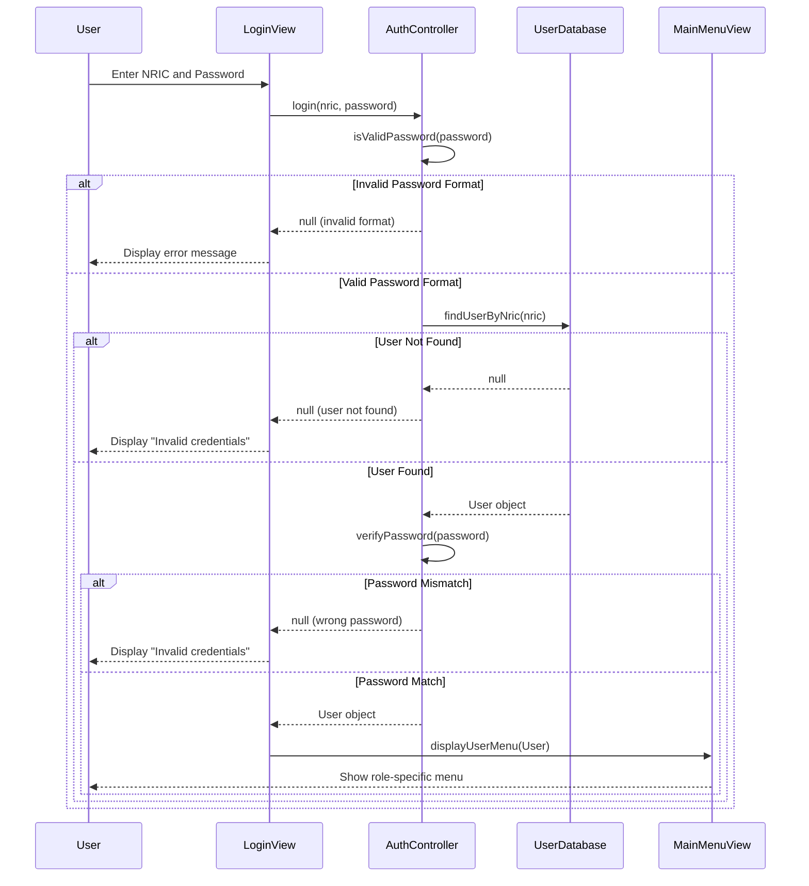
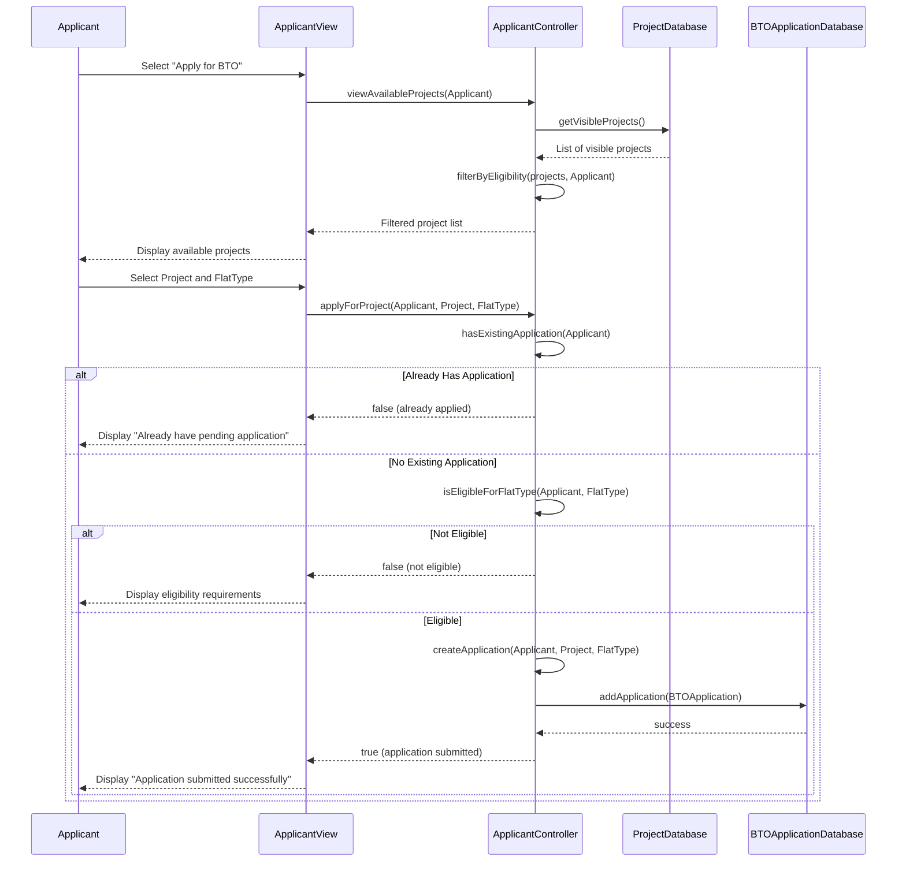
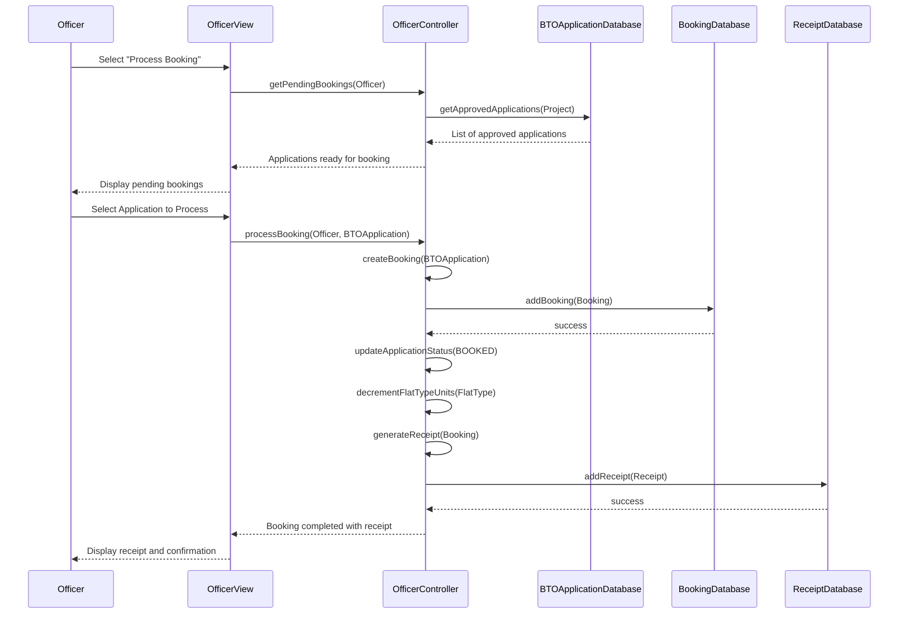
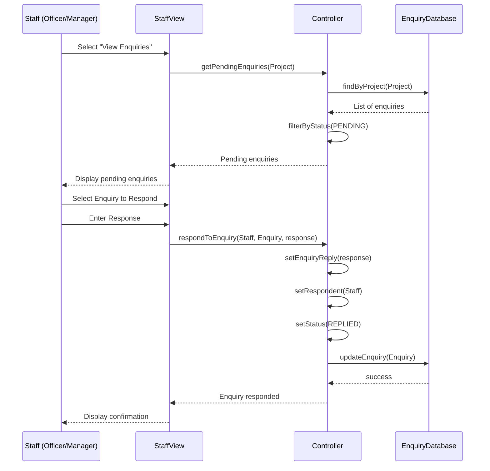
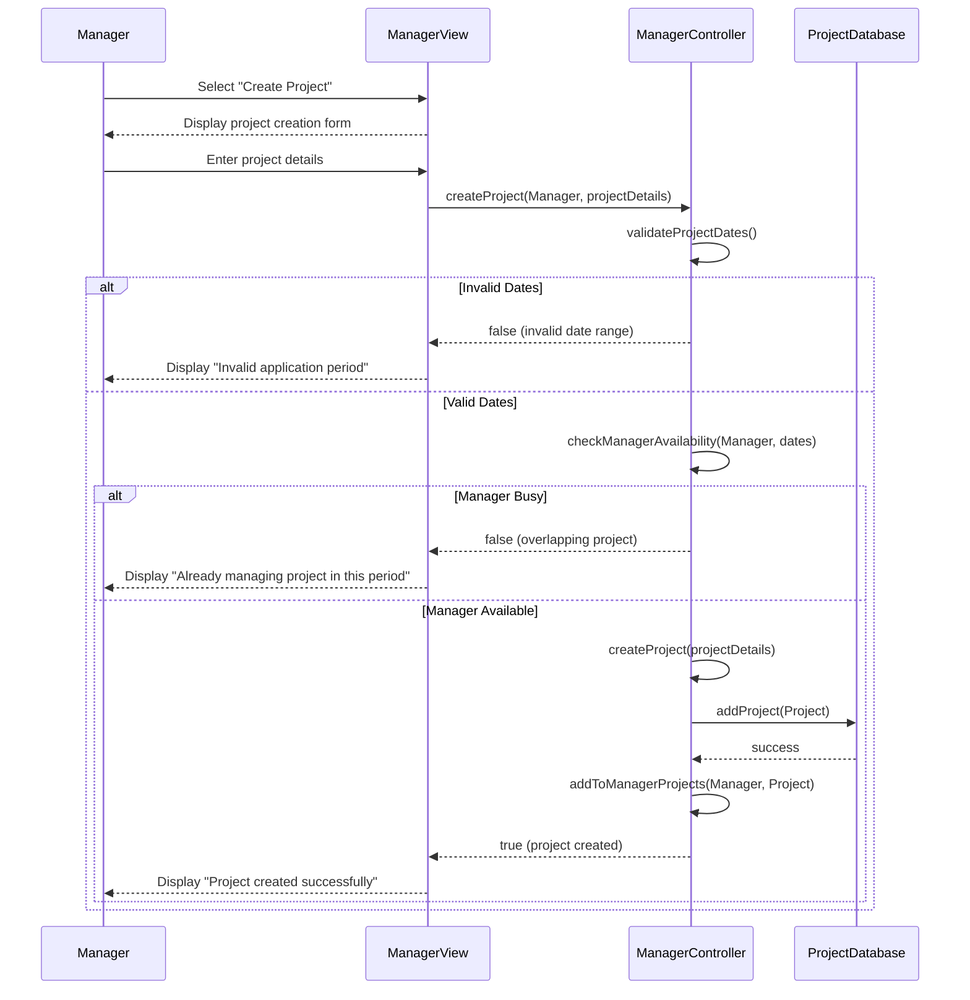

# BTO Management System

## Description

This system implements the BTO (Build-To-Order) application workflow for Singapore's public housing system. It manages the complete lifecycle from project creation by managers to application submission by applicants and processing by officers. The system implements proper role restrictions, authentication, and business logic according to HDB requirements.

## Table of Contents

- [Getting Started](#getting-started)
- [Usage](#usage)
- [System Architecture](#system-architecture)
- [Class Diagrams](#class-diagrams)
- [Sequence Diagrams](#sequence-diagrams)
- [Project Structure](#project-structure)
- [Developer Guide](#developer-guide)
- [Design Patterns](#design-patterns)
- [Contributors](#contributors)

## Getting Started

### Prerequisites

- Java Development Kit (JDK) 23 or above

## Usage

1. **Login**: Use the provided NRIC and password credentials
2. **Navigate**: Follow the menu prompts to access different functionalities
3. **Data Management**: Use the data files menu to load/save data

### Sample User Credentials

- **Applicant**: NRIC: S1234567A, Password: password (John)
- **Officer**: NRIC: T2109876H, Password: password (Daniel)
- **Manager**: NRIC: S5678901G, Password: password (Jessica)

## System Architecture

The system follows a layered **Entity-Boundary-Controller (EBC)** architecture pattern:

```
┌─────────────────────────────────────────────────────────────────┐
│                        Boundary Layer                           │
│  (LoginView, ApplicantView, OfficerView, ManagerView, etc.)    │
├─────────────────────────────────────────────────────────────────┤
│                       Controller Layer                          │
│  (ApplicantController, OfficerController, ManagerController)   │
├─────────────────────────────────────────────────────────────────┤
│                         Entity Layer                            │
│  (User, Applicant, Officer, Manager, Project, BTOApplication)  │
├─────────────────────────────────────────────────────────────────┤
│                        Database Layer                           │
│  (ApplicantDatabase, ProjectDatabase, BookingDatabase, etc.)   │
└─────────────────────────────────────────────────────────────────┘
```

## Class Diagrams

### Core Entity Inheritance Hierarchy



### Project and Application Domain Model



### Controller Layer Architecture



### Database Layer



## Sequence Diagrams

### User Authentication Flow



### BTO Application Submission Flow



### Booking Processing Flow (Officer)



### Enquiry Response Flow



### Manager Project Creation Flow



## Project Structure

The system follows a layered architecture with:

- `boundary`: User interface components
- `controller`: Business logic components
- `entity`: Domain objects and data models
- `database`: Data access components
- `utils`: Helper classes and utilities
- `enums`: Enumeration classes for fixed sets of values
- `interfaces`: Interfaces used throughout the system

## Developer Guide

This guide provides instructions for developers who want to work on the BTO Management System project.

### Development Environment Setup

#### Prerequisites

1. **Java Development Kit (JDK)**

   - Install JDK 23 or higher
   - Set the JAVA_HOME environment variable
   - Add Java's bin directory to your system PATH
2. **IDE Setup**

   - Eclipse (recommended)

     - Download and install Eclipse IDE for Java Developers
     - Launch Eclipse and select a workspace directory
   - Alternative IDEs

     - IntelliJ IDEA
     - VS Code with Java extensions
3. **Git (Optional)**

   - Install Git for version control
   - Configure Git with your username and email

#### Project Setup

1. **Clone the Repository (if using Git)**

   ```
   git clone https://github.com/Jared0024/BTO-Management-System.git
   cd BTO-Management-System
   ```
2. **Configure Build Path**

   - Right-click on the project in the Package Explorer
   - Select Build Path > Configure Build Path
   - Ensure the JRE System Library is set to JDK 23 or higher
   - Click Apply and Close

### Building and Running the Project

#### Method 1: Using Eclipse IDE

1. **Build the Project**

   - Project > Build Project (or let Eclipse auto-build)
2. **Run the Application**

   - Right-click src/main/Main.java
   - Select Run As > Java Application

#### Method 2: Command Line Compilation

1. **Navigate to the Project Root**

   ```
   cd path/to/BTO-Management-System
   ```
2. **Compile the Java Files**

   ```
   mkdir -p bin

   cd /src
   javac -d ..\bin main\*.java boundary\*.java boundary\filehandlerview\*.java controller\*.java database\*.java entity\*.java utils\*.java enums\*.java interfaces\*.java
   ```
3. **Run the Application**

   ```
   cd /bin
   java main.Main
   ```

### Working with Data Files

The application uses CSV files stored in the `datafiles` directory to persist data. During development:

1. **Data File Location**

   - The application expects data files in the `datafiles` directory at the project root
   - When running from the `src` directory, it looks for files at `../datafiles/`
2. **Loading Data Files**

   - Use the "Handle Data Files" option in the main menu to load data
   - When starting, select "Read All Files" to load all sample data at once

### File Layout

```
BTO-Management-System/
├── Class Diagrams/              # UML class diagrams for system architecture
├── datafiles/                   # CSV data storage files
│   ├── applicants.csv          # Applicant user data
│   ├── officers.csv            # Officer user data
│   ├── managers.csv            # Manager user data
│   ├── projects.csv            # BTO project data
│   ├── applications.csv        # BTO applications data
│   ├── bookings.csv            # Appointment booking data
│   ├── enquiries.csv           # User enquiries data
│   └── receipts.csv            # Payment receipt data
├── html/                       # Generated JavaDoc documentation
├── SequenceDiagrams/          # UML sequence diagrams for system workflows
└── src/                       # Source code directory
    ├── boundary/              # User interface components
    │   ├── MainMenuView.java
    │   ├── ApplicantView.java
    │   ├── OfficerView.java
    │   ├── ManagerView.java
    │   ├── ProjectView.java
    │   ├── ApplicationView.java
    │   ├── BookingView.java
    │   ├── EnquiryView.java
    │   └── FileHandlerView.java
    ├── controller/            # Business logic and data processing
    │   ├── ApplicantController.java
    │   ├── OfficerController.java
    │   ├── ManagerController.java
    │   ├── ProjectController.java
    │   ├── ApplicationController.java
    │   ├── BookingController.java
    │   └── EnquiryController.java
    ├── database/              # Data access and storage management
    │   ├── ApplicantDatabase.java
    │   ├── OfficerDatabase.java
    │   ├── ManagerDatabase.java
    │   ├── ProjectDatabase.java
    │   ├── ApplicationDatabase.java
    │   ├── BookingDatabase.java
    │   ├── EnquiryDatabase.java
    │   └── ReceiptDatabase.java
    ├── entity/                # Domain objects and data models
    │   ├── Applicant.java
    │   ├── Officer.java
    │   ├── Manager.java
    │   ├── Project.java
    │   ├── BTOApplication.java
    │   ├── OfficerApplication.java
    │   ├── Booking.java
    │   ├── Enquiry.java
    │   └── Receipt.java
    ├── enums/                 # Enumeration types for constants
    │   ├── UserType.java
    │   ├── ApplicationStatus.java
    │   ├── BookingStatus.java
    │   ├── EnquiryStatus.java
    │   └── ProjectStatus.java
    ├── interfaces/            # Interface definitions
    │   ├── User.java
    │   ├── Application.java
    │   └── Database.java
    ├── main/                  # Application entry point
    │   └── Main.java
    └── utils/                 # Helper classes and utilities
        ├── DisplayMenu.java   # Menu display and navigation
        ├── FileHandler.java   # File I/O operations
        ├── InputHandler.java  # User input processing
        └── Validator.java     # Data validation
```

### Loading Data Files

1. Run Main.java
2. Select "1. Handle Data Files" from the main menu
3. Select "1. Read Data Files"
4. Choose "10. Read All Files"
5. Verify all data is loaded successfully

## Common Issues and Solutions

### File Path Issues

If you encounter file path issues when running from different directories:

1. Ensure the `datafiles` directory is present at the project root
2. When running from the src directory, the application looks for files at `../datafiles/`
3. When running from the project root, modify the path in `FileHandlerReadView.java` to use `datafiles/` instead

## Design Patterns

- Model-View-Controller (MVC)
- Entity-Boundary-Controller (EBC)

## SOLID Principles

The application adheres to SOLID principles:

- **Single Responsibility**: Each class has only one responsibility
- **Open/Closed**: Entities are open for extension but closed for modification
- **Liskov Substitution**: User subtypes can substitute their their base type
- **Interface Segregation**: Focused interfaces for specific functionalities
- **Dependency Inversion**: High-level modules depend on abstractions

## Contributors

- JARED TAN SHU YI (CHEN SHUYI)
- AARON LOH WEI HAN
- TOH DE XUE
- TYLER TAN
- CHAI ZHI KANG
